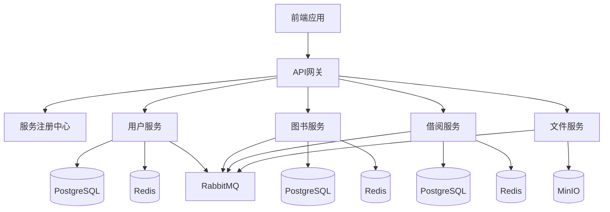

# 智慧图书管理系统 - 先进技术栈版

一个基于Vue 3 + Spring Cloud微服务架构的现代化图书管理系统，具备高性能、高可用、高扩展性特点。

## 🎯 技术选型

### 🖥 前端技术栈

| 技术 | 版本 | 描述 |
|------|------|------|
| Vue 3 | 3.3+ | 渐进式JavaScript框架，组合式API |
| TypeScript | 5.0+ | JavaScript的超集，提供类型系统 |
| Vite | 4.0+ | 新一代前端构建工具，极速开发体验 |
| Element Plus | 2.3+ | 企业级Vue组件库 |
| Pinia | 2.1+ | Vue状态管理库，类型安全 |
| Vue Router | 4.2+ | Vue官方路由管理器 |
| Tailwind CSS | 3.3+ | 实用优先的CSS框架 |
| Axios | 1.4+ | HTTP客户端，支持请求/响应拦截 |

### ⚙️ 后端技术栈

| 技术 | 版本 | 描述 |
|------|------|------|
| Spring Boot | 3.1+ | Java应用开发框架 |
| Spring Cloud | 2022.0+ | 微服务开发框架 |
| Spring Security | 6.1+ | 认证与授权框架 |
| Spring Data JPA | 3.1+ | ORM框架，简化数据访问 |
| MyBatis-Plus | 3.5+ | MyBatis增强工具，SQL优化 |
| PostgreSQL | 15+ | 开源关系型数据库 |
| Redis | 7.0+ | 内存数据库，缓存和会话存储 |
| RabbitMQ | 3.12+ | 消息队列，异步处理 |
| MinIO | Latest | 对象存储，兼容S3 API |
| Nacos | 2.2.3 | 服务注册与配置中心 |

## 🏗️ 系统架构

### 微服务架构图



### 前端架构

- **组件化开发**：基于Vue 3组合式API，高度复用
- **状态管理**：使用Pinia集中管理应用状态
- **路由管理**：Vue Router实现页面跳转和权限控制
- **样式方案**：Tailwind CSS + Element Plus组件库
- **构建工具**：Vite提供极速的开发和构建体验
- **类型安全**：TypeScript确保代码质量和IDE支持

### 后端架构

- **服务拆分**：按业务领域拆分为多个独立服务
- **服务通信**：RESTful API + 消息队列
- **数据存储**：PostgreSQL主存储 + Redis缓存 + MinIO对象存储
- **服务治理**：Nacos服务注册与配置中心
- **API网关**：统一入口，路由转发，安全过滤
- **容器化**：Docker镜像，支持Kubernetes部署

## 📊 数据库设计

### 核心表结构

#### 用户表 (users)
```sql
CREATE TABLE users (
    id BIGSERIAL PRIMARY KEY,
    username VARCHAR(50) UNIQUE NOT NULL,
    password VARCHAR(100) NOT NULL,
    email VARCHAR(100) UNIQUE NOT NULL,
    role VARCHAR(20) NOT NULL DEFAULT 'READER',
    avatar_url VARCHAR(255),
    phone VARCHAR(20),
    created_at TIMESTAMP DEFAULT CURRENT_TIMESTAMP,
    updated_at TIMESTAMP DEFAULT CURRENT_TIMESTAMP,
    status VARCHAR(20) DEFAULT 'ACTIVE'
);
```

#### 图书表 (books)
```sql
CREATE TABLE books (
    id BIGSERIAL PRIMARY KEY,
    isbn VARCHAR(20) UNIQUE NOT NULL,
    title VARCHAR(200) NOT NULL,
    author VARCHAR(100) NOT NULL,
    publisher VARCHAR(100) NOT NULL,
    publish_year INTEGER NOT NULL,
    price DECIMAL(10,2) NOT NULL,
    category VARCHAR(50),
    language VARCHAR(20),
    location VARCHAR(50),
    cover_image_url VARCHAR(255),
    description TEXT,
    total_quantity INTEGER DEFAULT 0,
    available_quantity INTEGER DEFAULT 0,
    created_at TIMESTAMP DEFAULT CURRENT_TIMESTAMP,
    updated_at TIMESTAMP DEFAULT CURRENT_TIMESTAMP,
    status VARCHAR(20) DEFAULT 'AVAILABLE'
);
```

#### 借阅记录表 (borrowings)
```sql
CREATE TABLE borrowings (
    id BIGSERIAL PRIMARY KEY,
    user_id BIGINT NOT NULL REFERENCES users(id),
    book_id BIGINT NOT NULL REFERENCES books(id),
    borrow_date TIMESTAMP DEFAULT CURRENT_TIMESTAMP,
    due_date TIMESTAMP NOT NULL,
    return_date TIMESTAMP,
    notes TEXT,
    status VARCHAR(20) DEFAULT 'BORROWED',
    created_at TIMESTAMP DEFAULT CURRENT_TIMESTAMP,
    updated_at TIMESTAMP DEFAULT CURRENT_TIMESTAMP
);
```

## 🚀 快速开始

### 前端开发

```bash
# 1. 进入前端目录
cd frontend-vue

# 2. 安装依赖
npm install

# 3. 启动开发服务器
npm run dev

# 4. 构建生产版本
npm run build
```

### 后端开发

```bash
# 1. 进入后端目录
cd backend-microservices

# 2. 构建所有服务
mvn clean package -DskipTests

# 3. 启动Nacos (服务注册中心)
docker run -d --name nacos \
  -e MODE=standalone \
  -p 8848:8848 \
  -p 9848:9848 \
  nacos/nacos-server:v2.2.3

# 4. 启动PostgreSQL
docker run -d --name postgres \
  -e POSTGRES_DB=library \
  -e POSTGRES_USER=library \
  -e POSTGRES_PASSWORD=library123 \
  -p 5432:5432 \
  postgres:15

# 5. 启动Redis
docker run -d --name redis \
  -p 6379:6379 \
  redis:7-alpine

# 6. 启动应用服务
java -jar user-service/target/user-service-2.0.0.jar
java -jar book-service/target/book-service-2.0.0.jar
java -jar borrow-service/target/borrow-service-2.0.0.jar
java -jar gateway-service/target/gateway-service-2.0.0.jar
```

### 容器化部署

```bash
# 一键部署所有服务
./advanced-tech-deploy.sh
```

## 🌟 功能特性

### 🎨 前端特性

- **现代化UI**：基于Element Plus的企业级组件
- **响应式设计**：完美适配桌面、平板、手机
- **暗黑模式**：支持明暗主题切换
- **国际化**：多语言支持
- **路由权限**：基于角色的路由访问控制
- **状态管理**：Pinia集中式状态管理
- **请求拦截**：统一的API请求处理
- **错误处理**：全局错误捕获与提示
- **代码分割**：按路由懒加载，优化首屏加载

### ⚙️ 后端特性

- **微服务架构**：服务独立部署，高可用性
- **服务发现**：Nacos自动服务注册与发现
- **配置中心**：动态配置管理，无需重启
- **负载均衡**：Ribbon客户端负载均衡
- **熔断降级**：Hystrix熔断机制
- **链路追踪**：分布式请求追踪
- **统一认证**：JWT令牌认证
- **混合数据访问**：JPA + MyBatis-Plus结合使用
- **分布式事务**：Seata分布式事务解决方案

## 📈 性能优化

### 前端优化

- **代码分割**：按路由分割代码，减少初始加载
- **资源压缩**：Gzip压缩，图片优化
- **CDN加速**：静态资源使用CDN
- **缓存策略**：HTTP缓存，本地存储
- **骨架屏**：优化首屏加载体验
- **图片懒加载**：延迟加载非关键图片

### 后端优化

- **数据库连接池**：HikariCP高性能连接池
- **查询优化**：索引优化，SQL调优
- **多级缓存**：本地缓存 + Redis分布式缓存
- **异步处理**：RabbitMQ消息队列
- **读写分离**：主从复制，读写分离
- **分库分表**：按业务模块拆分数据库

## 🛡️ 安全策略

### 前端安全

- **XSS防护**：输入输出过滤，CSP策略
- **CSRF防护**：Token验证，同源策略
- **敏感信息保护**：避免明文存储
- **HTTPS传输**：加密传输敏感数据

### 后端安全

- **认证授权**：OAuth2 + JWT令牌认证
- **SQL注入防护**：参数化查询，ORM框架
- **接口限流**：Guava RateLimiter限流
- **数据加密**：敏感信息加密存储
- **安全审计**：操作日志，访问记录

## 📊 监控告警

### 应用监控

- **Prometheus**：指标收集与存储
- **Grafana**：可视化监控面板
- **ELK Stack**：日志收集与分析
- **Alertmanager**：告警规则与通知

### 基础设施监控

- **Docker**：容器资源监控
- **Kubernetes**：集群状态监控
- **数据库**：性能指标与慢查询监控
- **缓存**：命中率和内存使用监控

## 🔮 未来规划

### 短期计划 (3个月)

- [ ] 完善微服务治理
- [ ] 添加单元测试和集成测试
- [ ] 实现分布式事务
- [ ] 优化数据库查询性能
- [ ] 添加数据可视化报表

### 中期计划 (6个月)

- [ ] 接入Kubernetes部署
- [ ] 实现CI/CD自动化流水线
- [ ] 添加数据分析功能
- [ ] 实现推荐系统
- [ ] 优化移动端体验

### 长期计划 (1年)

- [ ] 微服务网格集成 (Istio)
- [ ] 服务网格可观测性
- [ ] 云原生部署优化
- [ ] 智能运维集成
- [ ] 大数据处理能力

## 🤝 贡献指南

### 开发环境

- JDK 17+
- Node.js 18+
- Docker 20+
- Maven 3.8+

### 代码规范

- ESLint + Prettier 前端代码规范
- Checkstyle 后端代码规范
- Git Hooks 提交前检查
- Pull Request 代码审查

### 提交规范

- feat: 新功能
- fix: 修复bug
- docs: 文档更新
- style: 代码格式调整
- refactor: 代码重构
- test: 测试相关
- chore: 构建过程或辅助工具的变动

## 📄 许可证

MIT License